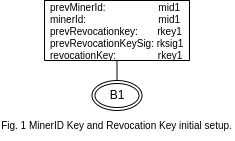
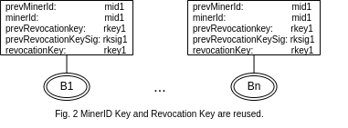
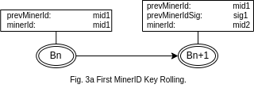
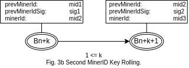
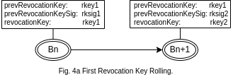
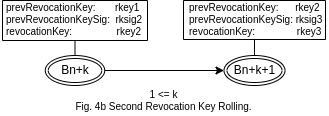
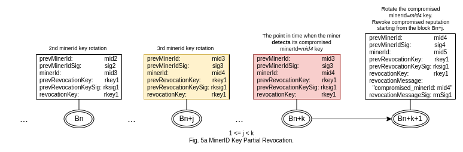
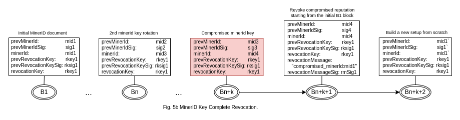

## RFC Notice

This draft specification is released as an RFC _(request for comment)_ as part of the public review process. Any comments, criticisms or suggestions should be directed toward the [issues page](https://github.com/bitcoin-sv-specs/brfc-minerid/issues) on this github repository.

A reference implementation of the Miner ID document server is available at [https://github.com/bitcoin-sv/minerid-reference](https://github.com/bitcoin-sv/minerid-reference)

# MinerId Specification

| **BRFC** | **title** | **authors** | **version** |
| ------------ | ------- | ------ | --- |
| 6a2e939f8d19 | minerId | nChain | 1.0 |

## 1. Introduction

Miners can identify themselves by including Miner information in transactions within the block. The relevant transactions are pointed to _(directly and indirectly)_ by the coinbase transaction of the block.

The Miner ID is recorded on the BSV main chain _(a.k.a active chain)_, consequently, the Miner ID protocol data present on a forked-branch will be ignored by the processing nodes. Moreover, the Miner ID reputation is built up as a sequence of Miner ID chains recorded on the BSV main chain. The initial miner info document defines the beginning of the first Miner ID chain. The beginning of the following chains is defined by the Miner ID key rotation. The protocol does not support parallel Miner ID chains. Any such occurrence indicates a malicious activity.

The protocol is cryptographically secured by two independent keys: the Miner ID and Revocation Key. The compromised miner can recover his identity if not more than one key is compromised.

Miner ID is a voluntary extra service that miners can offer and is not mandatory.

### 1.1 Benefits

Miner ID enables miners to build up a reputation over time that increases public confidence in their services, while at the same time protecting miners from manipulation and spoofing. A miner can also include additional information in the miner info document such as services offered, contact information, etc. Third parties can be confident that any message signed using the miner ID private key comes from that miner. It can be further used for chain analysis _(e.g. determining the number of blocks mined by a specific miner)_.

### 1.2 How to enable Miner ID

The Miner ID Generator is used to generate the Miner ID output _(Miner ID public key and signature)_; the pool operator can append that output to the coinbase transaction before mining for a new block.

[Miner ID Generator](docs/mid_generator/minerid-generator.md)

## 2. Changes to coinbase transaction to incorporate Miner ID

### 2.1 Coinbase transaction without Miner ID

**Coinbase Transaction**

| **inputs** | **outputs** | **value** |
| ---------- | ---------------------- | -------- |
| `coinbase` | `miner locking script` | `reward` |

### 2.2  Coinbase transaction with Miner ID

#### 2.2.1 Miner Info document

The table below shows the structure of the coinbase transaction, which refers to the transaction containing the miner info document and signature.

**Miner ID Coinbase Transaction**

| **inputs** | **outputs** | **value** |
| ---------- | :------------------------------------------------------------------------------------------ | -------- |
| `coinbase` | `miner locking script` | `reward` |
|            | `OP_0 OP_RETURN 0x601dface protocol-id-version miner-info-txid block-bind sig(block-bind)` | `0` |

The table below shows the structure of the miner info transaction containing the miner info document and signature.

**Miner Info Transaction**

| **inputs** | **outputs** | **value** |
| --- | :-------------------------------------------------------------------------- | --- |
| ... | `OP_0 OP_RETURN 0x601dface protocol-id-version miner-info sig(miner-info)` | `0` |
| ... | ... | ... |

The block height is included in the miner info document. The miner info transaction must be included in the same block as the Miner ID coinbase transaction referencing it.

Note that different data elements are encapsulated in Bitcoin PUSHDATA operation as described in this [data element framing standard](https://github.com/bitcoin-sv-specs/op_return/blob/master/01-PUSHDATA-data-element-framing.md)

| **attribute** | **description** |
| :-------------------- | :---------------------------------------------------------------------------------------- |
| `0x601dface`          | 4 byte miner ID [protocol prefix](https://github.com/bitcoin-sv-specs/op_return/blob/master/02-OP_RETURN-protocol-prefix-spec.md). |
| `protocol-id-version` | 1 byte protocol prefix version, must be 0. |
| `miner-info`          | The miner info document. It must be included in the first output of the miner info transaction _(at the index 0)_. |
| `sig(miner-info)`     | The signature on `miner-info` using the private key associated with the miner ID public key defined in `miner-info`. It must be included in the first output of the miner info transaction _(at the index 0)_.<br /> _Note: Only the data itself and NOT the PUSHDATA operations in the script are included in the signature message_. |
| `miner-info-txid`     | 32 byte transaction ID of the transaction containing the miner info document. |
| `block-bind`          | The hash over the modified Merkle root and previous block hash concatenated field, see [block binding technique](docs/block_binding_technique.md). |
| `sig(block-bind)`     | The signature on `block-bind` using the private key associated with the miner ID in the miner info transaction. |

#### 2.2.2 Miner Info document template

The miner info document is a stateless JSON document where a miner includes Miner ID information at a specified block height.

```
{
  "version": string,
  "height": number,

  "prevMinerId": string,
  "prevMinerIdSig": string,

  "minerId": string,

  "prevRevocationKey": string,
  "prevRevocationKeySig": string,

  "revocationKey": string,

  "revocationMessage": object,
  "revocationMessageSig": object,
  
  "minerContact": {
    "name": string,
    "merchantAPIEndPoint": string,
    "<any>": <any>
  },
  
  "extensions": {
    "authconn": {
        "PublicIP": string,
        "PublicPort": number
    }
  }
}
```

| **field** | **status** | **description** |
| :---------------------- | :----------------------: | :---------------------------------------------------------------------------------------- |
| `version`              | required | Miner ID implementation version number. |
| `height`               | required | Block height in which Miner ID document is included. |
| `prevMinerId`          | required | Previous minerId public key, a 33 byte hex string. |
| `prevMinerIdSig`       | required | Signature on message = `HASH256(concat(prevMinerId, minerId))` using the private key associated with the prevMinerId public key, 70-72 byte hex _(the concatenation is done on the hex encoded bytes)_. |
| `minerId`              | required | Current Miner ID ECDSA _(secp256k1)_ public key represented in compressed form as a 33 byte hex string. |
| `prevRevocationKey`    | required | Previous revocationKey public key, a 33 byte hex string. |
| `prevRevocationKeySig` | required | Signature on message = `HASH256(concat(prevRevocationKey, revocationKey))` using the private key associated with the prevRevocationKey public key, a 70-72 byte hex string _(the concatenation is done on the hex encoded bytes)_. |
| `revocationKey`        | required | Current revocation key ECDSA _(secp256k1)_ public key represented in compressed form as a 33 byte hex string. |
| `revocationMessage`    | conditionally required | [revocationMessage definition](#revocationmessage) |
| `revocationMessageSig` | conditionally required | [revocationMessageSig definition](#revocationmessagesig) |
| `minerContact`         | optional | Extra miner details _(with arbitrary number of subfields, none of which are required)_. |
| `extensions`           | optional | Additional data defined by MinerId extension BRFCs. This field may be omitted if no extensions are in use. |

##### revocationMessage

The revocation message field to be signed to certify the legitimate miner who wants to revoke past reputation.

The `revocationMessage` is a JSON object containing the compromised minerId public key - in the case of complete revocation it is the _minerId_ key defined by the initial Miner ID document:
```
"revocationMessage": {
    "compromised_minerId": string
}
```
The `revocationMessage` field is required in the miner info document only if one of the following occurs: [Rolling the Miner ID using Revocation Key](#441-rolling-the-miner-id-using-revocation-key) or [Complete Miner ID Revocation](#442-complete-miner-id-revocation).

##### revocationMessageSig

The field defines two different signatures on the `msg_hash := Hash256(compromised_minerId)` message digest.

The `revocationMessageSig` is a JSON object containing two signatures:
```
"revocationMessageSig": {
    "sig1": string,
    "sig2": string
}
```
> Note: `sig1` and `sig2` are 70-72 byte hex strings.

`sig1 := Sign(msg_hash, priv_revocationKey)`, where _priv\_revocationKey_ is the private key associated with the _revocationKey_ public key.

`sig2 := Sign(msg_hash, priv_minerId)`, where _priv\_minerId_ is the private key associated with the miner's:
- current miner ID public key defined in the complete revocation document by the _minerId_ data field, or
- previous miner ID public key defined in the partial revocation document by the _prevMinerId_ data field

The revocation document is a miner info document which does define a partial or complete miner ID key revocation _(see 4.4.1 and 4.4.2 sections)_.

The `revocationMessageSig` field is only required if the `revocationMessage` field is defined.

##### Extensions object

| **field** | **type** | **status** | **description** |
| ---------- | ------ | -------- | ------------------------------------------ |
| `dataRefs` | object | optional | See section 7 |
| `authconn` | object | optional | `"PublicIP": string, "PublicPort": number` |

#### 2.2.4 Miner info signatures.

The main signature which certifies each and every miner info document is _sig(miner-info)_. All other signatures defined by the protocol are included in the document itself, and thus coupled with the main signature. As a result, the miner ID key is always used to authorise any change in the document.

#### 2.2.5 Miner ID Extensions

The base MinerId protocol is intended to be extended with additional information as required. Extensions are out of scope for the base protocol and are described in additional BRFC documents. Extensions along with their BRFCs can be found in the `extensions` directory. For more info please check:

*   [blockinfo](extensions/blockinfo/README.md)
*   [feespec](extensions/feespec/README.md)
*   [minerparams](extensions/minerparams/README.md)

Internal extension data can be added in the `extensions` field of the miner info document. Each BRFC should encapsulate its additional data within its own JSON document inside the `extension` object of the relevant miner info document.

## 3. Two-key solution to Impersonation

Miners can identify themselves by including some recognisable data _(e.g. their name)_ in the coinbase transaction whenever they mine a block. However, this data can be forged and is not standardised.

The miner ID provides a way of cryptographically identifying miners that cannot be forged unless the Miner ID private key is compromised _(known to a 3rd party)_.

If the miner ID is compromised, a second "revocation" key can be used by the miner to force the roll of the miner ID to a new value chosen by the miner.

It is vital that both keys are not compromised. If both keys are known to a 3rd party then that party can take over the miner ID chain and the legitimate owner cannot do anything about it.

**ECDSA (secp256k1) keys used by the MinerID Protocol**

| **Name** | **Private key**\* | **Public key** | **Description** |
| :------------------ | :------------------ | :----------------- | :--------------------------------------------------------- |
| `minerId`           | Used to sign:<br /> a. the miner info document<br /> b. the `block-bind` data  <br /> c. the revocation message | Used in the miner info document. | Current MinerID key which identifies a miner. |
| `prevMinerId`       | Certifies _minerId_ key rotation. | Used in the miner info document. | Previous MinerID key. |
| `revocationKey`     | Signs the revocation message. | Used in the miner info document. | Current revocation key. |
| `prevRevocationKey` | Certifies _revocationKey_ key rotation. | Used in the miner info document. | Previous revocation key. |

> \* Must be secretly kept.

> Note:
    <br />1. All the keys are unique. If the private key from the private/public key pair becomes compromised, then the whole key is considered compromised.
    <br />2. A Miner ID is the public key of an ECDSA keypair. The Miner ID private key is used to sign a miner info document that is included as an OP\_RETURN output of a transaction in a block; the coinbase transaction of the same block points to that transaction.

## 4. Key Management

Keys can be compromised. Many security protocols require keys to be changed at regular intervals to improve security. It is a requirement that the specification supports:

*   planned rolling of the miner ID key or revocation key.
*   rolling of the miner ID key in response to a spoofed miner ID on the blockchain.
*   rolling of the revocation key in response to a data breach.
*   complete revocation of a miner ID.

### 4.1 Initial Key Setup

_Use case: Create a new Miner ID reputation chain._

The first Miner ID miner info document assigns:

*   the same miner ID public key to _prevMinerId_ and _minerId_ fields defined in the protocol _(which marks the beginning of the MinerID reputation chain)_.
*   the same revocation public key to _prevRevocationKey_ and _revocationKey_ fields; it also contains _prevRevocationKeySig_ signature to confirm the possession of the corresponding revocation private key.



> Note: The _prevMinerIdSig_ field is not defined because _prevMinerId == minerId_ and the miner info document itself is signed by _minerId_ private key.

The protocol assumes that the keys initialised in the first miner info document can be reused by consecutive miner info documents until the key rolling or key revocation occurs.



### 4.2 Miner ID Key Rolling

_Use Case: Typically this protocol would be invoked to satisfy security protocols that require that keys be changed at regular intervals, or if it is suspected that someone has knowledge of the miner ID private key who should not have._

The protocol replaces the currently active private/public Miner ID key pair with a new one, and thus the former _minerId_ public key becomes _prevMinerId_ public key in the new miner info document. To authorise the Miner ID Key Rolling procedure the _prevMinerIdSig_ signature must be created and included in the new miner info document. This will prove that the miner possesses the corresponding private key of the public key which is being rotated.





If the _prevMinerIdSig_ is invalid, then the Miner ID Key attached to the block or notification is regarded as invalid and processing proceeds as if the Miner ID document was not present.

> Note:
    <br />1. The currently active Miner ID key is always the one indicated by the last miner info document recorded on the active chain by the genuine miner.
    <br />2. The Miner ID key can be rotated if either its lifespan has elapsed or the key has been classified as compromised.
    <br />3. The final signature over the miner info document - _sig(miner-info-doc)_ using the current _minerId_ private key - certifies the MinerID Key Rolling procedure.

### 4.3 Revocation Key Rolling

_Use Case: Typically this protocol would be invoked to satisfy security protocols that require that keys be changed at regular intervals, or if it is suspected that someone has knowledge of the revocation private key who should not have._

The section describes the protocol used to roll the revocation key if there is no active attempt to impersonate the revocation key. 

The protocol replaces the currently active private/public revocation key pair with a new one, and thus the former _revocationKey_ public key becomes _prevRevocationKey_ public key in the new miner info document. To authorise the Revocation Key Rolling procedure the _prevRevocationKeySig_ signature must be created and included in the new miner info document. This will prove that the corresponding private key _(of the public key which is being rotated)_ is accessible by the miner.





If the _prevRevocationKeySig_ signature is invalid, then the whole miner info document is considered as invalid.

> Note:
    <br />1. The currently active revocation key is always the one indicated by the last miner info document recorded on the active chain by the genuine miner.
    <br />2. The revocation key can be rotated if either its lifespan has elapsed or the key has been classified as compromised.
    <br />3. The final signature over the miner info document - _sig(miner-info-doc)_ using the current _minerId_ private key - certifies the Revocation Key Rolling procedure.

### 4.4 Key Revocation Protocol

_The Miner ID reputation chain is required to be a part of the BSV main chain, and thus any change in the Miner ID protocol data must also be recorded on the BSV main chain. This approach guarantees that new nodes will interpret the Miner ID reputation chain correctly during the IBD process._

Key Revocation is an optional 2-key solution to security issues. The _minerId_ private key is used in the day-to-day operation of miner ID. A separate revocation key-pair is kept in reserve _(possibly off-site)_ to restore compromised or potentially compromised _minerIds_.

If the revocation key also becomes compromised, then the miner has effectively lost control of his on-chain identity and he will need to rebuild his identity from scratch.

The revocation private key should remain as secure as possible and not be distributed unnecessarily - It is therefore not expected to be available for automated signing. The revocation key can only be defined at the same time as the first _minerId_ in the chain of _minerIds_, although it can be rotated in the future.

#### 4.4.1 Rolling the Miner ID using Revocation Key

_Use Case: Typically this protocol would be invoked if an attacker has generated a block successfully marked with the miner ID belonging to someone else. I.e. The attacker has successfully impersonated the miner. The miner knows exactly which minerId private key has been compromised. The revocation key has NOT been compromised._

The section describes the protocol used to roll the miner ID key using the revocation key.

This type of attack requires the attacker to know the miner ID private key.

The compromised miner can decide to partially revoke its reputation if he knows exactly which _minerId_ private key is compromised in his reputation chain. The partial revocation requires to define the _revocationMessage_ and _revocationMessageSig_ fields as well as to rotate the compromised _minerId_ public key in the next miner info document _(the revocation document)_.

The following example illustrates how to revoke the compromised _minerId=mid4_ public key first detected in the recent _Bn+k_ block. The _Bn+k+1_ block contains the miner info revocation document which defines _minerId_ key rotation of the compromised key, as well as revokes miner's compromised reputation starting from the _Bn+j_ block by using _revocationMessage_ and _revocationMessageSig_.



> Note:
    <br />1. The partial revocation only applies to the Miner ID reputation recorded on the active chain.
    <br />2. Only the current _revocationKey_ private key can be used to sign _revocationMessage_. The old rotated revocation keys are invalid. In Fig. 5a the current revocation key is _rkey1_.
    <br />3. The revocation message is also being signed by the miner ID private key. In Fig. 5a the private key associated with the current compromised _mid4_ public key is the right one to use _(the mid5 key will become the current uncompromised miner ID key once the revocation document is successfully recorded on the active chain)_.
    <br />4. The final signature over the miner info revocation document - _sig(miner-info-doc)_ - is created using the new _minerId=mid5_ private key and included in the miner info transaction belonging to the _Bn+k+1_ block.

#### 4.4.2 Complete Miner ID Revocation

_Use case: Typically this protocol is invoked when the miner ID is compromised and the policy is to revoke the entire miner ID chain and start a new chain. The miner is uncertain which minerId private key has been compromised in the chain, and thus wants to invalidate the entire chain to prevent the miner's data to be reused by an attacker. The revocation key has NOT been compromised._

The section describes the protocol used to completely revoke the entire Miner ID reputation.

In order to completely revoke the past Miner ID reputation, the miner needs to include the first minerId public key (defined by the initial Miner ID document) in the _revocationMessage_ field and create _revocationMessageSig_ signature. The Miner ID or Revocation Key Rolling doesn't occur in the revocation document. The _prevMinerId_ field is set to the same value as the _minerId_ field. The revocation process is considered as completed when the revocation document is recorded on the active chain. After that, the legitimate miner must setup a new identity from scratch.

The Fig. 5b example shows _Bn+k+1_ block containing miner info document where complete revocation is defined. After that the miner must to recreate its reputation chain from scratch - what is shown by _Bn+k+2_ block.



> Note:
    <br />1. The complete revocation only applies to the Miner ID reputation recorded on the active chain.
    <br />2. Only the current _revocationKey_ private key can be used to sign _revocationMessage_. The old rotated revocation keys are invalid. In Fig. 5b the current revocation key is _rkey1_.
    <br />3. The current revocation keys can be reused by the miner info document defined in the _Bn+k+2_ block _(the first block of the new identity)_.
    <br />4. The revocation message is also being signed by the miner ID private key. In Fig. 5b the private key associated with the current compromised _mid4_ public key is the right one to use.
    <br />5. The final signature over the miner info revocation document - _sig(miner-info-doc)_ - is created using the current  _minerId=mid4_ private key and included in the miner info transaction belonging to the _Bn+k+1_ block.

## 5. P2P announcements

_Use case: A PoW-independent notification sent by a miner to inform its connection peers about the compromised minerId key. The announcement refers to the Miner ID blocks recorded on the active chain._

To allow instant revocation of the compromised _minerId_ public key the protocol introduces a new P2P _revokemid_ message. It is not expect that the whole network is reachable via P2P messages, and thus the P2P message should be interpreted as an early announcement of the compromised _minerId_ public key. If the given node gets a valid revocation message, then it should invalidate the compromised _minerId_ public key in its own Miner ID database.

[P2P revokemid message](https://github.com/bitcoin-sv-specs/protocol/blob/master/p2p/miner_id.md)

## 6. DataRefs

The `dataRefs` field enables miner info documents to include data contained in other transactions. The miner info document will likely be widely requested by users along with block headers in the future. As such it is in the miner's interests to keep the miner info relatively small. A data reference allows data to be stored in other transactions and consolidated into a miner info document.

The reference points to another transaction output that is expected to contain a JSON object. The contents of that JSON object should be merged into the `extensions` field. Note that the signatures are over the original miner info document containing the dataRef object and do not include the data itself. A hash of the data is included through the `txid`.

The referenced transaction need not necessarily be included in the same block, allowing old data to be reused.

> Note: We do not sign the additional data as the transaction id serves as a binding in the signature. The data cannot be changed without rendering the transaction ID invalid.

### Template

The `dataRefs` object should be located in the `extensions` field of the miner info document.

```
"extensions": {
  "dataRefs": {
    "refs": [
      {
        "brfcIds": string[],
        "txid": string,
        "vout": number,
        "compress": string
      },
      {
        "brfcIds": string[],
        "txid": string,
        "vout": number,
        "compress": string
      }
    ]
  }
}
```

#### `dataRefs` object:

| **field** | **description** |
| -------- | :---------------------------------------------------------------------------------------- |
| `dataRefs` | Extension name |
| `refs`     | Array of reference objects with fields: `brfcIds`, `txid`, `vout`, and `compress` _(optional)_ that each refer to a specific transaction output _(TXO)_ |

#### `refs` object:

| **field** | **description** |
| -------------------- | :---------------------------------------------------------------------------------------- |
| `brfcIds`             | An array of BRFC ID strings indicating which extensions have data in the remote reference. This can be used to decide if the data is interesting to the user or not. |
| `txid`                | Transaction ID of the transaction containing additional miner info document data. |
| `vout`                | Vout index of the output containing additional miner info document data. |
| `compress` _(optional)_ | If present, specifies a compression algorithm used to uncompress the target data blob. `gzip` is specified initially. |

### Example

#### `dataRefs` fields:

```
"extensions": {
  "dataRefs": {
    "refs": [
      {
        "brfcIds": ["62b21572ca46", "a224052ad433"],
        "txid": "c6e68a930db53b804b6cbc51d4582856079ce075cc305975f7d8f95755068267",
        "vout": 2,
        "compress": "gzip"
      },
      {
        "brfcIds": ["b8930c2bbf5d", "1b1d980b5b72"],
        "txid": "1bc783a5f7a0e5ef2016caf52cfeabb4b1f43039d57bc07144a5de12382deaf5",
        "vout": 0,
        "compress": "gzip"
      }
    ]
  }
}
```

### Referenced output script:

The transaction output referenced by the `txid` and `vout` fields of each `refs` object in the miner info documents should contain an output script at index 0. If there is more than one referenced output script to include, then each of them must be placed separately in the next consecutive output.

The format of the referenced output script is:

> `OP_0 OP_RETURN 0x601dface protocol-id-version OP_PUSHDATA json`

| **field** | **description** |
| ----- | :---------------------------------------------------------------------------------------- |
| `json` | The brfcId field name should conform to [BRFC ID Assignment](https://bsvalias.org/01-02-brfc-id-assignment.html).<br /> If the dataRef specifies a `compress` field this data may be compressed.<br /><br /> Example:<br /> ```{ "brfcId1": { ... }, ... }``` |

### Consolidated miner info document:

```
"extensions": {
  "dataRefs": {
    "refs": [{
        "brfcIds": ["62b21572ca46", "a224052ad433"],
        "txid": "c6e68a930db53b804b6cbc51d4582856079ce075cc305975f7d8f95755068267",
        "vout": 2,
        "compress": "gzip"
      },
      {
        "brfcIds": ["b8930c2bbf5d", "1b1d980b5b72"],
        "txid": "1bc783a5f7a0e5ef2016caf52cfeabb4b1f43039d57bc07144a5de12382deaf5",
        "vout": 0,
        "compress": "gzip"
      }
    ],
    
    "data": {
      "62b21572ca46": {
        // data for BRFC: 62b21572ca46
      },
      "a224052ad433": {
        // data for BRFC: a224052ad433
      },
      "b8930c2bbf5d": {
        // data for BRFC: b8930c2bbf5d
      },
      "1b1d980b5b72": {
        // data for BRFC: 1b1d980b5b72
      }
    }
  }
}
```
> Note: The `"data"` section contains extension data that are defined in the referred to TXOs.

### 6.1 Dataref transaction retrieval

[P2P getdata message extension](https://github.com/bitcoin-sv-specs/protocol/blob/master/p2p/miner_id.md)

## 7. Enriched header changes

[P2P messages sendhdrsen / gethdrsen / hdrsen](https://github.com/bitcoin-sv-specs/protocol/blob/master/p2p/miner_id_headers.md)

## 8. Appendix

### 8.1 Sample Miner ID implementation

|[JavaScript](minerId-generator.js)|

```
npm install
npm start
```

### 8.2 Miner ID Integration & Deployment Instructions

[Integration and Deployment](docs/integration_and_deployment.md)

## 9. Changelog

| **version** | **description** |
| ------- | :---------------------------------------------------------------------------------------- |
| 0.1 | Initial specification. |
| 0.2 | Change encoding of `prevMinerIdSig` _(use hex encoding instead of default utf8)_. |
| 1.0 | Replace the VCTX transaction by the Revocation Keys. Static and dynamic coinbase documents replaced with miner info document. Coinbase transaction now contains a reference to the miner info document rather than containing the miner info document. Protocol specifier updated.  |
