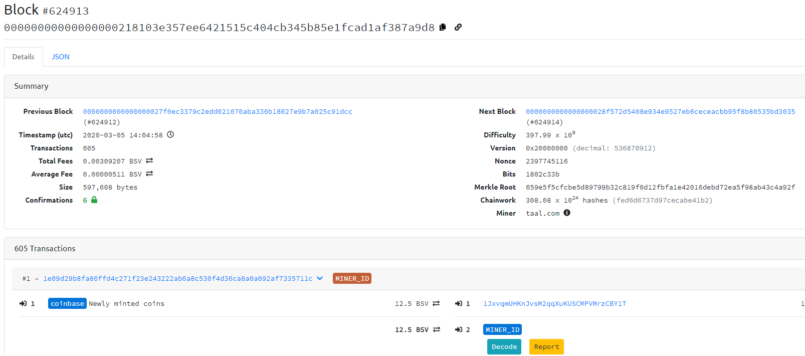

## RFC Notice

This draft spec is released as an RFC (request for comment) as part of the public review process. Any comments, criticisms or suggestions should be directed toward the [issues page](https://github.com/bitcoin-sv-specs/brfc-minerid/issues) on this github repository.

A beta reference implementation of the Miner ID document server is available at https://github.com/bitcoin-sv/minerid-reference

# MinerId Specification

|     BRFC     |  title  | authors | version |
| :----------: | :-----: | :-----: | :-----: |
| 07f0786cdab6 | minerId | nChain  |   0.1   |

## 1. Introduction

In the current design, Miners identify themselves by including some data in the malleable input fields of the coinbase transaction whenever they mine a block. However, this data is not always accurate and can be forged.

The MinerId change provides a way of cryptographically identifying miners. A MinerId is a public key of an ECDSA keypair. It is used to sign a coinbase document and is included as an OP_RETURN output in the coinbase transaction of a block, instead of providing unsigned arbitrary data. It must be noted that MinerId is a voluntary extra service that miners can offer and is in no way mandatory.

## 1.1 Purpose

A MinerId will enable miners build up a reputation over time to increase public confidence in their services, while at the same time protecting themselves from miner manipulation and spoofing. A miner can also include additional information in the coinbase document such as services offered, contact information. Third parties can be confident that any message signed using the private key of the miner Id comes from that miner and can be used to for further chain analysis, for example calculating the number of blocks that miner has mined.

## 1.2 How to enable MinerId

The MinerId generator is used to generate the MinerId output which includes the coinbase document and a signature on it with the MinerId private key. The pool operator can then simply append that output to the coinbase transaction before mining for a new block.

Refer to sample MinerId generator code in [JavaScript](minerId-generator.js) or [Golang](minerId-generator.go)

## 2 Context diagram



## 3 Design changes to coinbase Tx

The changes implemented allow for the inclusion of the MinerId in the coinbase transaction as follows:

## 3.1 Current design: Coinbase transaction (without MinerId)

|            |      coinbase tx       |          |
| ---------- | :--------------------: | :------: |
| **inputs** |      **outputs**       |  value   |
| `coinbase` | `miner locking script` | `reward` |

```json
{
  "txid": "4201d9c9dcbc834780bbbbaa03cab835cc191271a19bf98f8ec21ed3c1dc784b",
  "hash": "4201d9c9dcbc834780bbbbaa03cab835cc191271a19bf98f8ec21ed3c1dc784b",
  "version": 1,
  "size": 118,
  "locktime": 0,
  "vin": [
    {
      "coinbase": "03855c092f636f696e6765656b2e636f6d2f775931ba631dbfe872e47c7f650000",
      "txid": "",
      "vout": 0,
      "scriptSig": {
        "asm": "",
        "hex": ""
      },
      "sequence": 4294967295
    }
  ],
  "vout": [
    {
      "value": 12.5235674,
      "n": 0,
      "scriptPubKey": {
        "asm": "OP_DUP OP_HASH160 8460e9a972a8600766a1b38fac4a2cfb8692d3ad OP_EQUALVERIFY OP_CHECKSIG",
        "hex": "76a9148460e9a972a8600766a1b38fac4a2cfb8692d3ad88ac",
        "reqSigs": 1,
        "type": "pubkeyhash",
        "addresses": ["1D4xHwLxA8E9vU87N1ELHtPEZdKeLhywY1"]
      }
    }
  ]
}
```

## 3.2 New design: Coinbase transaction (with MinerId)
        
### Static and Dynamic documents

The miner ID is broken up into a static and a dynamic section. This can potentially facilitate bulk pre-signing of parts of the document in advance whilst allowing additional data that cannot be known until the block template is built to be incorporated and signed seperately.  This may be useful in cases where a miner wishes to maintain their ID but delegate block template building to another party. In order to form the final CD document the static and dynamic parts should be merged. 

* If the dynamic coinbase document is present then a valid signature over that block MUST also be present otherwise the entire coinbase document, including the static document, must be considered invalid even if the static signature is correct.
* It is not valid for a dynamic field to overwrite the value of a field in the static part of the document without specifically being authorised in the static document. In the absence of authorization the dynamic value should be ignored when merging the documents rather than invalidating the entire document. The authorization mechanism is not yet defined but will be part of a future BRFC.


|            |                                         coinbase tx                                         |          |
| ---------- | :-----------------------------------------------------------------------------------------: | :------: |
| **inputs** |                                         **outputs**                                         |  value   |
| `coinbase` |                                   `miner locking script`                                    | `reward` |
|            | `OP_0` `OP_RETURN` `0xAC1EED88` `static-CD` `sig(static-CD)` `dynamic-CD` `sig(dynamic-CD)` |   `0`    |

Note that different data elements are encapsulated in Bitcoin PUSHDATA operation as described in this [data element framing standard](https://github.com/bitcoin-sv-specs/op_return/blob/master/01-PUSHDATA-data-element-framing.md)

| attribute                    | description                                                                                                                                                                                                                                                                                                                                                                                |
| ---------------------------- | ------------------------------------------------------------------------------------------------------------------------------------------------------------------------------------------------------------------------------------------------------------------------------------------------------------------------------------------------------------------------------------------ |
| `AC1EED88`                   | 4 byte MinerId [protocol prefix](https://github.com/bitcoin-sv-specs/op_return/blob/master/02-OP_RETURN-protocol-prefix-spec.md)                                                                                                                                                                                                                                                           |
| `static-CD`                  | The main coinbase document containing data that is static, not affected by block template content and can be known in advance                                                                                                                                                                                                                                                              |
| `sig(static-CD)`             | Signature over the static coinbase document using current MinerId (hex value)                                                                                                                                                                                                                                                                                                              |
| (optional) `dynamic-CD`      | Contains data that may change since the time the static-CB was signed                                                                                                                                                                                                                                                                                                                      |
| (optional) `sig(dynamic-CD)` | Signature over the concatenation of `static-CD`, `sig(static-CD)` and `dynamic-CD`, using the private key associated with the public key declared in the `dynamicMinerId` fields of the `static-CB`. If the `dynamic-CD` is present this signature field is mandatory. Note: that only the data itself and NOT the pushdata operations in the script are included in the signature message |

```json
{
  "txid": "6e15167c0fcfa848c9d680a083ed4ae9feb092b10b991e42c84b8b47b1beaa64",
  "hash": "6e15167c0fcfa848c9d680a083ed4ae9feb092b10b991e42c84b8b47b1beaa64",
  "version": 1,
  "size": 829,
  "locktime": 0,
  "vin": [
    {
      "coinbase": "035a890064656d6f2d6d696e65721d5b8da25262ce2501000000",
      "txid": "",
      "vout": 0,
      "scriptSig": {
        "asm": "",
        "hex": ""
      },
      "sequence": 4294967295
    }
  ],
  "vout": [
    {
      "value": 0,
      "n": 0,
      "scriptPubKey": {
        "asm": "OP_DUP OP_HASH160 357692bd21462caf0ddb029b18e4b63a02ce86be OP_EQUALVERIFY OP_CHECKSIG",
        "hex": "76a914357692bd21462caf0ddb029b18e4b63a02ce86be88ac",
        "reqSigs": 1,
        "type": "pubkeyhash",
        "addresses": ["mkPe9qAiN6yMcyC8Xs8H1eKBo9HavpVqtV"]
      }
    },
    {
      "value": 0,
      "n": 1,
      "scriptPubKey": {
        "asm": "0 OP_RETURN 6163316565643838 7b2276657273696f6e223a22302e31222c22686569676874223a223335313632222c22707265764d696e65724964223a22303366396430353766366666363630366636313533303238313264623337663665636364643533316364643263333231363733616631383763663764626262396165222c22707265764d696e65724964536967223a223330343430323230363538393639613361383462663634383039643838343564623161353164613630326363653038333837336136633337376336336261346136393832396261303032323033386435373239643233396562613161333434656636343138343539333266383538633063616563633935313266373166626234336537373539616562636566222c226d696e65724964223a22303366396430353766366666363630366636313533303238313264623337663665636364643533316364643263333231363733616631383763663764626262396165222c2276637478223a7b2274784964223a2231316339663062653535646138383139326631623635333834363839373562636663313633356334386631636539656561653132636461656663356134633939222c22766f7574223a307d2c226d696e6572436f6e74616374223a7b226e616d65223a2264656d6f222c22656d61696c223a2264656d6f4064656d6f2e636f6d222c226d65726368616e74415049456e64506f696e74223a22687474703a2f2f64656d6f2d6d696e657269642e636f6d227d7d 3330343430323230376361613966393666316439626533336430316664613663323165643132306132396535356464643163373535343730623935373765626630373761303234363032323030353739333734386438383261376335343862303336336264343264656466393131366463373862653230333162343461323462633131616263326365656135",
        "hex": "006a0861633165656438384d27027b2276657273696f6e223a22302e31222c22686569676874223a223335313632222c22707265764d696e65724964223a22303366396430353766366666363630366636313533303238313264623337663665636364643533316364643263333231363733616631383763663764626262396165222c22707265764d696e65724964536967223a223330343430323230363538393639613361383462663634383039643838343564623161353164613630326363653038333837336136633337376336336261346136393832396261303032323033386435373239643233396562613161333434656636343138343539333266383538633063616563633935313266373166626234336537373539616562636566222c226d696e65724964223a22303366396430353766366666363630366636313533303238313264623337663665636364643533316364643263333231363733616631383763663764626262396165222c2276637478223a7b2274784964223a2231316339663062653535646138383139326631623635333834363839373562636663313633356334386631636539656561653132636461656663356134633939222c22766f7574223a307d2c226d696e6572436f6e74616374223a7b226e616d65223a2264656d6f222c22656d61696c223a2264656d6f4064656d6f2e636f6d222c226d65726368616e74415049456e64506f696e74223a22687474703a2f2f64656d6f2d6d696e657269642e636f6d227d7d4c8c3330343430323230376361613966393666316439626533336430316664613663323165643132306132396535356464643163373535343730623935373765626630373761303234363032323030353739333734386438383261376335343862303336336264343264656466393131366463373862653230333162343461323462633131616263326365656135",
        "type": "nulldata"
      }
    }
  ]
}
```

## 3.2.1 Static coinbase document template

The static coinbase document in the coinbase transaction is a stateless JSON document where a miner includes MinerId information at a specified block height.

```json
{
  "version": string,
  "height": number,

  "prevMinerId": string,
  "prevMinerIdSig": string,
  "dynamicMinerId": string,

  "minerId": string,

  "vctx": {
    "txId": string,
    "vout": number
  },

  "minerContact": {
    "name": string,
    "merchantAPIEndPoint": string,
    "<any>": <any>
  },

  "extensions": {
    
  }
}
```

| attribute        | description                                                                                                                                                                                                                          |
| ---------------- | ------------------------------------------------------------------------------------------------------------------------------------------------------------------------------------------------------------------------------------ |
| `version`        | MinerId implementation version number                                                                                                                                                                                                |
| `height`         | block height in which MinerId document is included                                                                                                                                                                                   |
| `prevMinerId`    | previous MinerId public key, a 33 byte hex                                                                                                                                                                                           |
| `prevMinerIdSig` | signature on message = `concat(prevMinerId, MinerId, vctxid)` using the private key associated with the prevMinerId public key, 70-73 byte hex                                                                                       |
| `minerId`        | current MinerId ECDSA (secp256k1) public key represented in compressed form as a 33 byte hex string                                                                                                                                  |
| `dynamicMinerId` | optional ECDSA (secp256k1) public key represented in compressed form as a 33 byte hex string that is authorised to sign the dynamic coinbase document (described later in this document) - this can be the same as the minerId field |
| `vctx`           | validity check transaction output that determines whether the MinerId is still valid                                                                                                                                                 |
| `vctx: txId`     | validity check transaction output transaction ID, 32 byte hex                                                                                                                                                                        |
| `vctx: vout`     | validity check transaction output number                                                                                                                                                                                             |
| `minerContact`   | extra miner details (optional with arbitrary number of subfields)                                                                                                                                                                    |
| `extensions`     | additional (optional) data defined by MinerId extension brfcs. This field may be omitted if no extensions are in use                                                                                                                 |

## 3.2.2 Example MinerId coinbase document

The `CD` and `sig(CD)` in proper JSON fromat decoded from the transaction (as shown on [WoC](https://whatsonchain.com/tx/0252d56c222839ab9b727104f3e4b87bc4f1c97178cce572b23d0c3f4a65bddd)):

```json
{
  "document": {
    "version": "0.1",
    "height": 624455,
    "prevMinerId": "022604665d3a186be9690231a279f8e18b800f4ce78caac2d51940c8c1c92a8354",
    "prevMinerIdSig": "3044022067452f9d9baeef327183e2f565c8c4d76299287d6c0253aa133c75150d78d307022029c9d93ac08c19e20a03dc32307c4f0a023e79a505c02b01857c84d49670acf6",
    "minerId": "022604665d3a186be9690231a279f8e18b800f4ce78caac2d51940c8c1c92a8354",
    "dynamicMinerId": "022604665d3a186be9690231a279f8e18b800f4ce78caac2d51940c8c1c92a8354",
    "vctx": {
      "txid": "6584f53e13216d34979098362bda34bd3677058c8b4e0621b24395c576b6baad",
      "vout": 0
    }
  },
  "signature": "3045022100ae0bc35173357a3afc52a39c7c6237a0b2f6fdaca3f76667bde966d3c00655ff02206767755766be7b7252a42a00eb3aa38d62aae6acf800faa6ff3ea1bb74f4cf05"
}
```

## 3.2.3 Key design decisions

| Ref. | Decision                                                                                                                                                                                                                                                                                                                                                                                                                                                                    |
| ---- | --------------------------------------------------------------------------------------------------------------------------------------------------------------------------------------------------------------------------------------------------------------------------------------------------------------------------------------------------------------------------------------------------------------------------------------------------------------------------- |
| 001  | The private key associated with the MinerId public key is used to sign a coinbase document and is included as an OP_RETURN output in the coinbase transaction of a block.                                                                                                                                                                                                                                                                                                   |
| 002  | As the document is stateless, the previous and current MinerIds are included in the document (where they are both the same value if it is the first MinerId or no change has occurred). Where they are different this should be treated as a key rotation of the MinerId and the successive public keys should be treated as part of the same MinerId.                                                                                                                      |
| 003  | vctx is included to enable the miner revoke their MinerId (if it is compromised for example). the miner could intentionally or otherwise add a field in the coinbase document specifying if the MinerId is still valid or not. However, by doing that, the miner would have to wait until they mine a block to revoke their MinerId key. Using the vctx, the miner can at any time revoke the validity of their MinerId key without having to wait until they mine a block. |
| 004  | security hardening is an optional feature. Refer to discussion notes in the Appendix 4.2 for further detail.                                                                                                                                                                                                                                                                                                                                                                |

## 3.2.4 MinerId extensions

The base MinerId protocol is intended to be extended with additional information as required.  Extensions are out of scope for the base protocol and are described in additional BRFC documents. By convention all extension data is contained with the `extensions` fields of either the `static-CB` or the `dynamic-CD` depending on the nature of the data.  Each BRFC should encapsulate it's additional data within it's own json document inside the `extenstions` object of the relevant CB document.

## 4. Appendix

## 4.1 Sample MinerId generator

| [JavaScript](minerId-generator.js) |
  
| [Golang](minerId-generator.go) |

## 4.2 Security hardening (optional)

### Design discussion notes

Ideally, the MinerId (by extension the coinbase transaction) should be specific to the block it is in. By making the MinerId specific to the block it's mined in, we effectively bind the signature to the block it's contained in. Without this binding, a malicious miner could take your entire coinbase document and put it in another block, potentially in a block that damages reputation e.g. by including well known double spends. Because the block height is included in the coinbase document, the malicious miner would effectively have to orphan the block containing the signature they want to reuse (after it is mined) which makes the attack expensive. This cost may be enough to deter the attack in most cases.

However, as miner reputations become more valuable there could possibly be cases where the increased market share that comes from knocking a major miner out of the trusted network and causing them lose access to semi-trusted services has enough upside to justify the cost.

In the case of a private miner, this is even more secure as the coinbase document would not be revealed until the block is mined meaning the attacker would have to win a block race *after* the block they are trying to orphan is propogated.  In the case of a pool though the coinbase transaction is known to all participants in the pool ahead of time eliminating this time disadvantage.

If a miner is not satisfied with the security described above, they can optionally implement an extension technique to harden security described in the MinerId extension: `MinerIdExt-blockBind`. 
