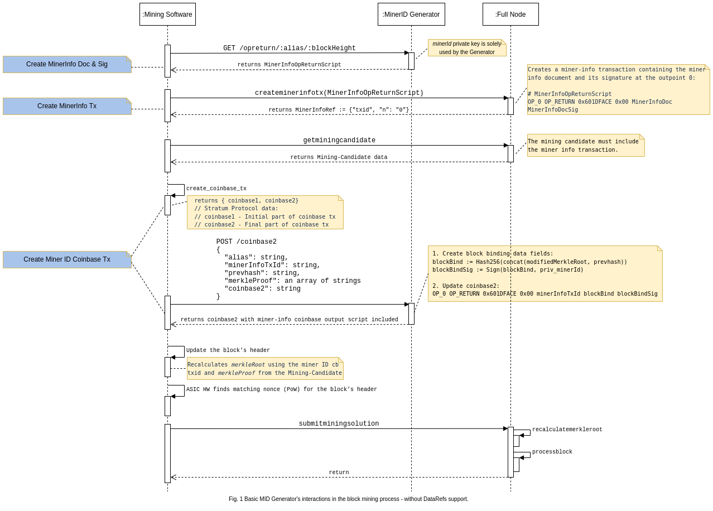
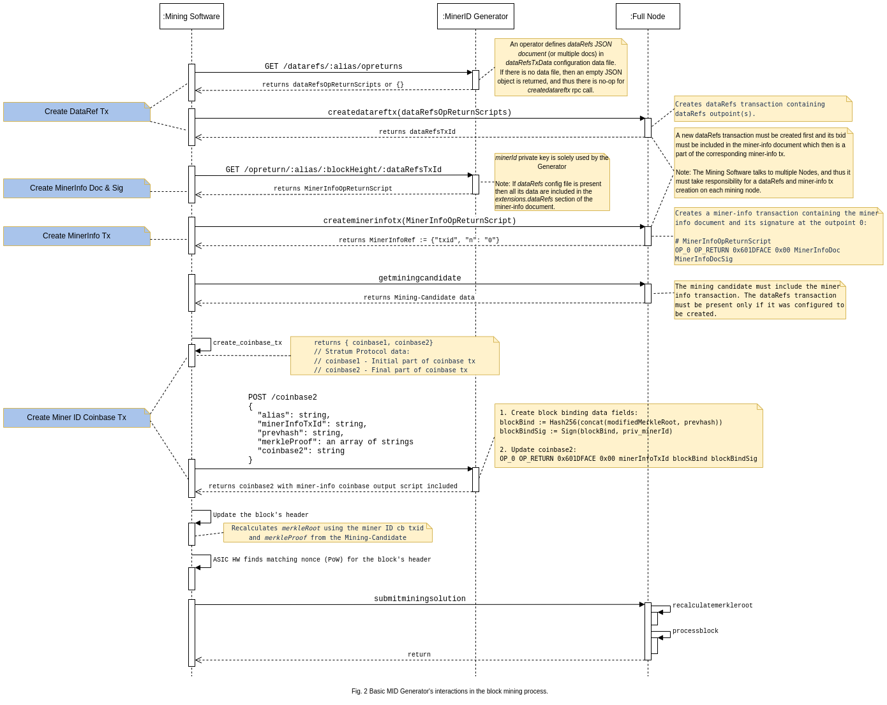
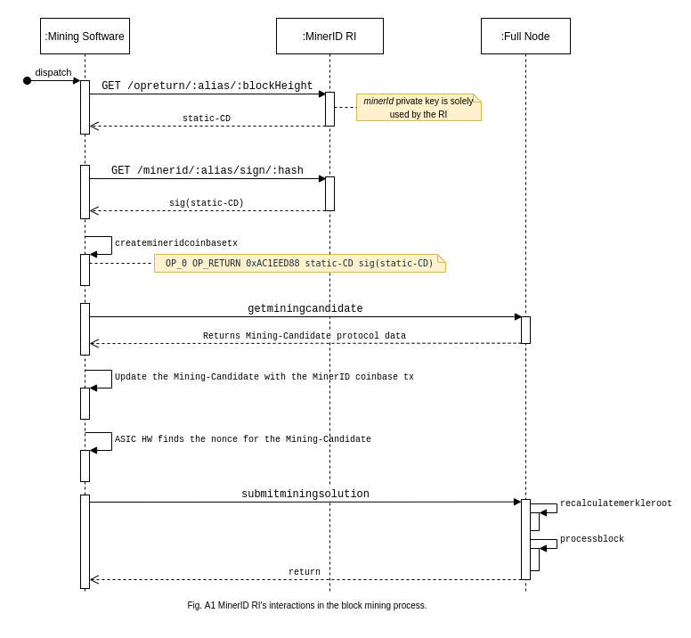
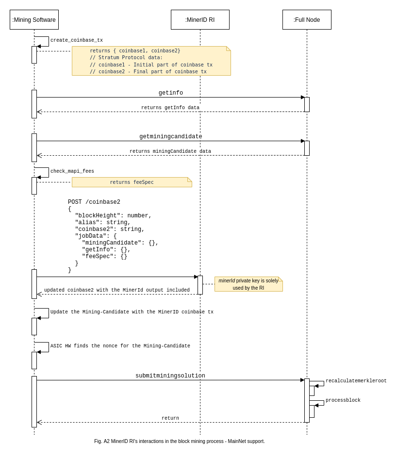

Miner ID Generator
==================

The Miner ID Generator _(a.k.a MID Generator)_ is a service built around private keys specified in the Miner ID Protocol. The service creates the keys and uses them to generate signatures required by the protocol, although some signatures are expected in the miner info document infrequently. This property allows the service to adopt different built-in polices for storing private keys.

**ECDSA (secp256k1) private keys created and used by the MID Generator**

| Name            | Availability | Storage policy |
| :------------------ | :--------: | :----------------------------------- |
| `minerId`           | online  | **Locally secure private key store**\* |
| `prevMinerId`       | online  | **Locally secure private key store**\* |
| `revocationKey`     | offline | **Offline secure private key store**\*   _(e.g., HW module)_ |
| `prevRevocationKey` | offline | **Offline secure private key store**\*   _(e.g., HW module)_ |

> \* Used to store the key and sign messages.

A reference implementation of the Miner ID document server is available at [https://github.com/bitcoin-sv/minerid-reference](https://github.com/bitcoin-sv/minerid-reference).

## 1. Operations

Key operations supported by the service:

1.  Create a new Miner ID reputation chain.
2.  Generate private keys (both online and offline).
3.  Create a miner info doc and its signature.
4.  Rotate _minerId_ key.
5.  Rotate _revocationKey_ key.
6.  Revoke _minerId_ reputation.
7.  Sign a revocation message _(used by a miner info doc and the P2P _revokemid_ network message)_.

> Out-of-scope: 
    1.  Control of lifespan of the keys _(e.g. scheduled key expiry)_. 
    2.  Detection of compromised keys.

## 2. Interfaces

### 2.1 CLI

CLI interface is expected to be used by an administrator to perform configuration, initial set up, service management and manual interactions specific to the Miner ID protocol.

Administrative tasks involve:

1.  Create a Miner ID reputation chain.
2.  Generate private keys.
    1.  an online _minerId_ key.
    2.  an offline _revocationKey_ key.
3.  Rotate a compromised _minerId_ key.
4.  Rotate a compromised _revocationKey_ key.
5.  Sign a revocation message and notify the node.
    1.  Admin specifies _minerId_ to be revoked.

> Note: 
    1.  A reference implementation will use template file _(e.g., MinerID.json)_. 
    2.  A callback to the node is required because the node must send out the _revokemid_ network message _(the outcome of the point 5)_.

#### 2.1.1 Commands

| Name | Parameter | Description |
| :------------------------ | :------------------------------- | :---------------------------------------------------- |
| `generateminerid`         | `--name foo`  | Creates a new Miner ID chain with the given _foo_ name.  Generates the _minerId_ and _prevMinerId_ private keys _(minerId == prevMinerId)_.  Generates the _revocationKey_ and _prevRevocationKey_ private keys _(revocationKey == prevRevocationKey)_. |
| `getcurrentminerid`       | `--name foo` | Returns the current _minerId_ public key for the specified _foo_ chain. |
| `rotatemineridkey`        | `--name foo` | Rotates the _minerId_ private key used by the existing Miner ID _foo_ chain. |
| `rotaterevocationkey`     | `--name foo` | Rotates the _revocationKey_ private key used by the existing Miner ID _foo_ chain. |
| `revokemineridpartially`  | `--name foo --minerid minerId` | Revokes rotated Miner ID reputation chains. It cannot revoke the initial chain.  Requires to specify the _minerId_ public key to be revoked in the compromised Miner ID _foo_ chain using the [revocation message](../../README.md#revocationmessage).  Signs the revocation message for the compromised Miner ID _foo_ chain.  Notifies the node to trigger [P2P revokemid](https://github.com/bitcoin-sv-specs/protocol/blob/master/p2p/miner_id.md) network message. |
| `revokemineridcompletely` | `--name foo` | Revokes all Miner ID reputation chains starting from the initial chain.  Uses the _minerId_ public key from the initial _foo_ chain to create the [revocation message](../../README.md#revocationmessage).  Signs the revocation message for the _foo_ chain.  Notifies the node to trigger [P2P revokemid](https://github.com/bitcoin-sv-specs/protocol/blob/master/p2p/miner_id.md) network message. |
| `upgrademinerid`          | `--name foo` | Upgrade Miner ID v0.1/v0.2 protocol data to v1.0. It updates an old _foo_ chain configuration to be compliant with the newest protocol version. |

### 2.2 RESTful Web API

Adopt an existing API to interact with the mining software.

### 2.3 DataRefs

DataRefs support is explained in the MID Generator [README](https://github.com/bitcoin-sv/minerid-reference/) document.

## 3. Interactions in the Block Mining Process

This section specifies basic interactions in the block mining process between the Mining Software, the Miner ID Generator and the Node.

**:Mining Software -> :Miner ID Generator**

The Mining Software communicates with the Miner ID Generator through Web API interface to:

1.  create dataRefs outpoint scripts if dataRefs configuration was enabled by an operator.
2.  create a miner info document _(including the specified block height in the request)_ and its signature.
3.  update coinbase2 with `miner-info-txid` and its signature.

**:Mining Software -> :Full Node**

The Mining Software communicates with the Full Node through RPC interface to:

1.  create a dataRefs tx if it was configured to be created.
2.  create a miner info tx containing a miner info document and its signature.
3.  get a mining candidate.
4.  submit a mining solution.

The proposed solution introduces a new RPC interface required to create a miner info transaction. It also changes the existing - in the v0.2 version - Web API interface to fulfil v1.0 requirements.

**Pros**

1.  In this way the existing _getminingcandidate_ and _getblocktemplate_ RPCs don't have to be changed because the Miner ID Protocol is an optional feature.
2.  The _createminerinfotx_ RPC should be invoked only once for the current block height _(the height of a block to be mined)_. The Mining Software doesn't have to call it again _(prior to the next getminingcandidate call)_ if the block height returned in the next mining candidate is the same.
    1.  The Mining Software periodically calls _getminingcandidate_ on all the nodes _(from the mining pool)_ and picks the one which contains the highest number of transactions. If the current block height has not been mined yet, then the next returned mining candidate contains the same block height value and most likely a higher number of transactions.

**Cons**

1.  Introducing _createminerinfotx_ adds a new extra call in the communication process which could be avoided by adding a new input argument for _getminingcandidate_ and _getblocktemplate_.

The diagrams below visualise basic interactions between the components. They only show the recommended _getminingcandidate_ RPC _(which returns block header + merkleProof)_ as it is a simplified version of _getblocktemplate_ RPC.

*   The Fig. 1 is a simplified integration without DataRefs support
*   The Fig. 2 includes an optional DataRefs feature

**A special case to cover by the Mining Software**

If a reorg didn't occur and _getminingcandidate_ returns the next mining candidate with a new block height _(which is equal to the prev block height + 1)_, then it means that:

1.  The active chain tip has been extended by a block mined by someone else _(not by the miner's mining pool)_.
2.  The Mining Software must interact with other components to create a new:
    1.  DataRefs transaction (if it is configured to be created).
    2.  Miner info document and its signature.
    3.  Miner info transaction.
    4.  Miner ID Coinbase Tx.
3.  It skips the last result of _getminingcandidate_ _(which doesn't contain the miner info tx)_ and calls _getminingcandidate_ again.
    1.  This will occur _(the fact of skipping one result which is only treated as an indicator of the tip's change)_ if the last block was mined by someone else.

## 4. Appendix (Historical Data)

### MinerId Builder RI v0.2

This section describes an existing implementation compliant with the MinerID Protocol v0.2.

#### Interactions in the Block Mining Process

##### Basic support without extensions

*   :Mining Software → :MinerID RI 
*   :Mining Software → :Full Node

The Mining Software uses two _GET_ REST API methods to get the _static-CD and sig(static-CD)_ _(GET /opreturn/:alias/:blockHeight([0-9]+) and GET /minerid/:alias/sign/:hash respectively)_.

##### Basic support with extensions

*   :Mining Software → :MinerID RI 
*   :Mining Software → :Full Node

The Mining Software uses the _POST /coinbase2_ REST API method to add the Miner ID output to _coinbase2_.

The production script should handle the following:

1.  `getInfo` _(a result of getinfo RPC)_.
2.  `miningCandidate` _(a result of getminingcandidate RPC)_.
3.  Gets _mAPI fees_ and includes them in the request.

1-3 data are included in the _jobData_ field and sent to the MinerID RI through the _POST /coinbase2_ Web API request.

## 5. References

1.  [MinerId Generator - Reference Implementation](https://github.com/bitcoin-sv/minerid-reference)
